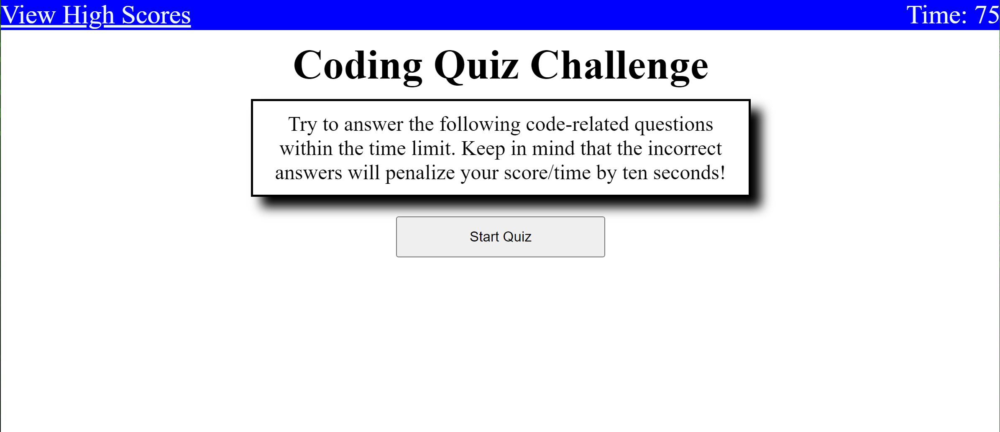
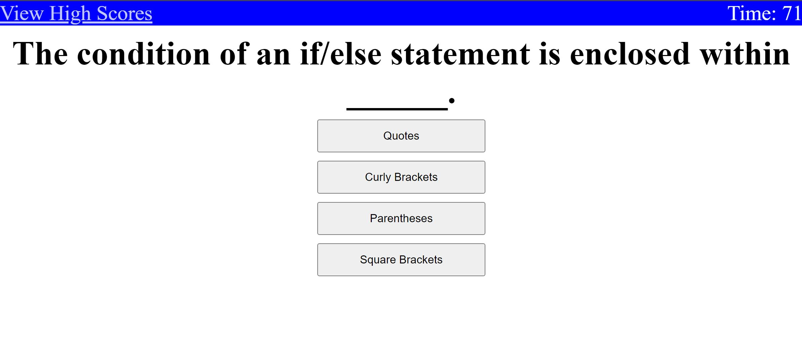
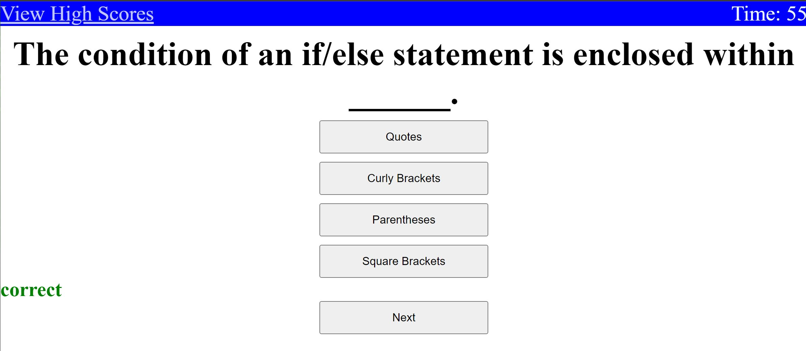
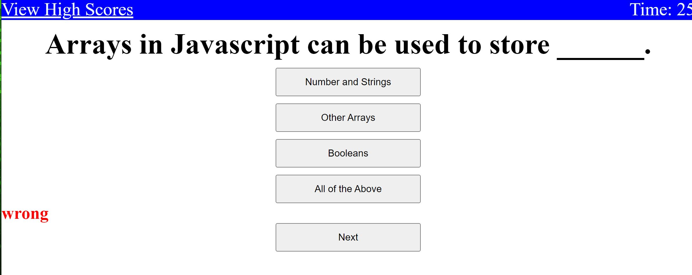
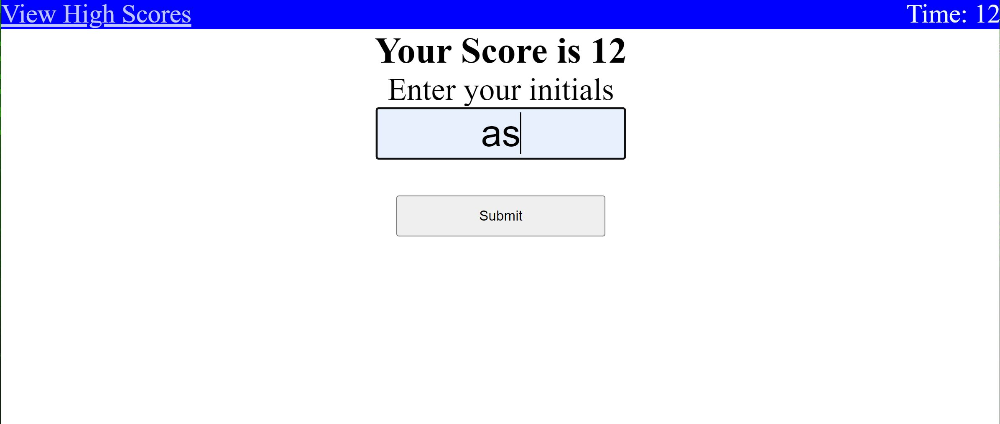
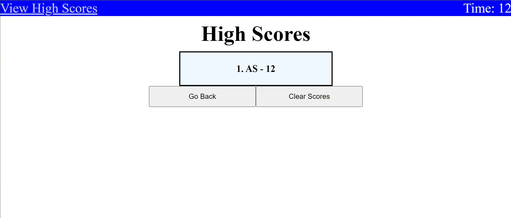

# JavaScript-Quiz

## Description
This week challenge was all about API's. We had to create a functioning website that would make the user take a multiple choice test about javascript. It would ask the user a total of 5 questions and within those 5 questions there were 4 options to choose from. If the user answered correctly it would alert them on the page that it was correct, otherwise it would diplay wrong and subtract 10 seconds of the starting time of 75seconds,  then the user would click on the next button to go on with the next question. If the user ran out of time or finished all the questions, then the game would end and the user would need to put their initials to summarize their score. Their score and initials would then be displayed on a leaderboard along with other users scores. The most difficult part of this project was figuring out a way to hide and diplay the section you needed. I learned so much about the DOM and ways to get user input and make interactive. 

## Usage
This image demostrates the web application appearance and fuctionality
.
.
.
.
.
.

## Credits
I used the activites in the UCSD folder to help me with this project as well as the help of a tutor. I also want to link a youtube tutorial that helped me better understand how to do this project.
https://youtu.be/riDzcEQbX6k?si=00-2y-517F7e_i_O
## License
N/A

## Features
Gives the users multiple questions and times them to see what their highest score can be and stores those values in local storage

## Deployed Application
https://aserrano7.github.io/JavaScript-Quiz/